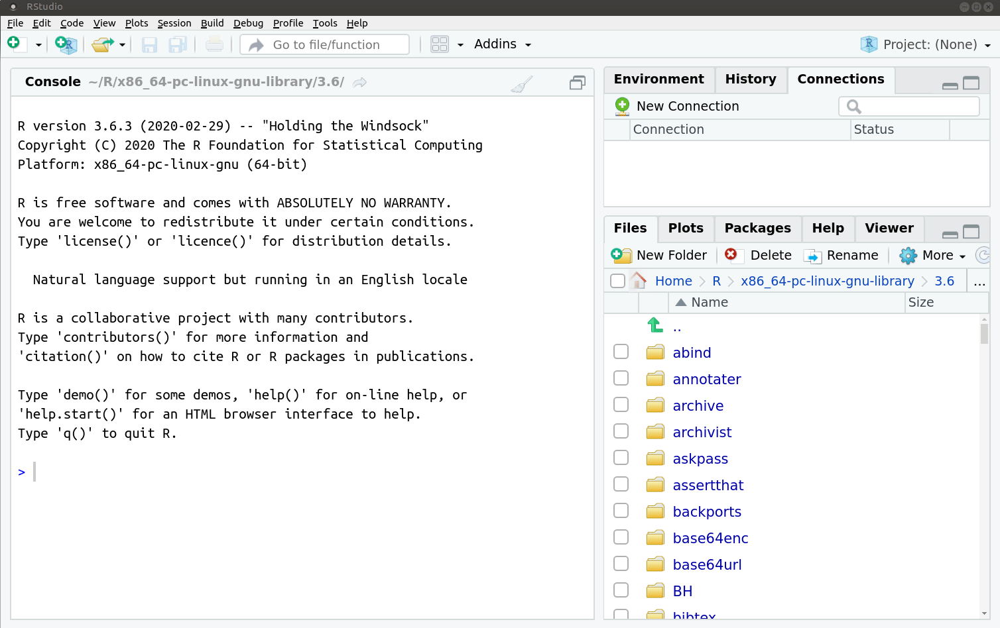
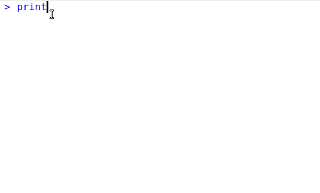

```{r, include = F}
# This is the recommended set up for flipbooks
# you might think about setting cache to TRUE as you gain practice --- building flipbooks from scratch can be time consuming
knitr::opts_chunk$set(fig.width = 6, message = FALSE, warning = FALSE, comment = "", cache = FALSE, fig.retina = 3)
library(flipbookr)
library(dplyr)
library(flair)
library(kableExtra)
library(fontawesome)
#library(icons)
```
```{r xaringan-themer, include=FALSE, warning=FALSE}
library(xaringanthemer)
style_xaringan(header_color = "#980043", code_inline_font_size = "2em", header_background_color =  "#980043")
style_duo_accent(
  #base_color = "#43a2ca",
  header_font_google = google_font("Mukta"),#Ubuntu Condensed
  text_font_google   = google_font("Montserrat", "300", "300i"),
  code_font_google   = google_font("Fira Mono"),
  primary_color      = "#980043", # pantone classic blue #0F4C81
  secondary_color    = "#1c9099", # pantone baby blue #b3e2cd
  #header_font_google = google_font("Raleway"),
  #text_font_google   = google_font("Raleway", "300", "300i"),
  #code_font_google   = google_font("Source Code Pro"),
  text_font_size     = "25px"
#   colors = c(
#   red = "#f34213",
#   purple = "#3e2f5b",
#   orange = "#ff8811",
#   green = "#136f63",
#   white = "#FFFFFF",
# )
)

```

```{r, include=FALSE}
text_spec2 <- function(x = "x"){
  kableExtra::text_spec(x, background = "#b3e2cd", bold = T)
}

text_spec3 <- function(x = "x"){
  kableExtra::text_spec(x, color = "deeppink", bold = T)
}
text_spec4 <- function(x = "x"){
  kableExtra::text_spec(x, color = "#fd8d3c", bold = T)
}
text_spec5 <- function(x = "x"){
  kableExtra::text_spec(x, color = "#08519c", bold = T)
}
```


class: hide-logo
# Características del curso

```{r setup, include=FALSE}
options(htmltools.dir.version = FALSE)
knitr::opts_chunk$set(warning = FALSE, message = FALSE)
```


.left-column[
`r fa(name = "laptop", fill = "#756bb1", height =  "2em", width = "2em")`
<br><br>

`r fa("link", fill = "#756bb1", height =  "2em", width = "2em")`
<br><br>

`r fa("question", fill = "#756bb1", height =  "2em", width = "2em")`
<br><br>

`r fa("home", fill = "#756bb1", height =  "2em", width = "2em")`
<br><br>

`r fa("comments", fill = "#756bb1", height =  "2em", width = "2em")`
<br><br>

`r fa("file-alt", fill = "#756bb1", height =  "2em", width = "2em")`
]

.right-column[ 
Espacio "presencial": `r text_spec2("15 horas")` de clases teóricas/prácticas. 14, 16, 21, 23 y 28 de junio.
<br>

[Espacio virtual](https://eva.fcs.udelar.edu.uy/course/view.php?id=875"): presentación de clase, live-coding, ejercicios, auto-test. 
<br>

Participar durante la clase a través del `r text_spec2("chat")` o `r text_spec2("pedir la palabra")`.
<br>

Comunicación: `r text_spec2("foro y mail")`

`r text_spec2("Dedicación:")` durante el curso y después ... es la .red[clave]
<br>


`r text_spec2("Examen")` requisito para aprobar el curso. Fechas: 2/8/2021,	2/10/2021,	2022
<br>
]

---
# Objetivos del curso 

- Introducción al lenguaje `r text_spec2("R")` mediante `r text_spec2("RStudio")`

- Manejar un gran conjunto de `r text_spec2("funciones: básicas y más avanzadas")`

- Generar `r text_spec2("autonomía")` para usar R y `r text_spec2("seguir aprendiendo")` después del curso

- Aprender a programar en R a través de la `r text_spec2(" lógica tidyverse")` para lograr rápidamente:

  - Trabajar con `r text_spec2("datos reales")` e interesantes.

  - `r text_spec2("Procesar")` y transformar los datos. 

  - Crea `r text_spec2("visualizaciones")` atractivas e informativas.

---
class: hide-logo
# ¿Qué haremos hoy?

- `r text_spec2("¿Qué es R?")`
--

- Usar R como  `r text_spec2("calculadora")`
--

- Introducción a `r text_spec2("RStudio")`
--

- Conceptos básicos: `r text_spec2("objetos y clase de objetos")`
<br><br>
--

-  `r text_spec2("Vectores")`: numéricos, lógicos y de caracteres
--

-  `r text_spec2("Funciones")` y `r text_spec2("operadores")`
--

- Marco de datos (`r text_spec2("data frame")`)
<br>
--

- `r text_spec2("Importar")` un archivo csv
--

-  `r text_spec2("Explorar")` un conjunto de datos (data frame)
<br>
--

- Extensiones a R base: `r text_spec2("paquetes")`
--

- `r text_spec2("Script")`
--

- `r text_spec2("Directorio de trabajo")` y `r text_spec2("Entorno de trabajo")` 


---
class: hide-logo
# ¿Qué es `r fa("r-project", fill = "#384CB7")`?


.left-column[

`r fa("chart-area", fill = "#756bb1", height =  "2em", width = "2em")`
 <br>

`r fa("code", fill = "#2c7fb8", height =  "2em", width = "2em")` <br>


`r fa("creative-commons-nd", fill = "#636363", height =  "2em", width = "2em")` <br>


`r fa("osi", fill = "#31a354", height =  "2em", width = "2em")` <br>


`r fa("github", height =  "2em", width = "2em")` <br>


`r fa("meetup", fill = "#de2d26", height =  "2em", width = "2em")` <br>

]

.rigth-column[

`r text_spec2("Programa estadístico")`: análisis
<br><br>

`r text_spec2("Lenguaje")` de programación: sintaxis
<br><br>

Software `r text_spec2("gratuito")`, se desacarga desde [CRAN](http://www.r-project.org).
<br><br>

Software `r text_spec2("libre")`: licencia [GNU](https://es.wikipedia.org/wiki/GNU_General_Public_License). Libertad de uso, modificación y  distribución.
<br>

`r text_spec2("Comunidad")` mundial: lo usa y mejora. Casi 20.000 paquetes en [CRAN]((https://cran.r-project.org/web/packages/)) y [github](https://github.com/)
<br>

Comunidad en Uruguay: [meetup R-Ladies](https://www.meetup.com/es-ES/rladies-montevideo/) y [meetup GURU](https://www.meetup.com/es-ES/GURU-mvd/)
]

---
# ¿Qué podemos hacer en R?

.pull-left[
- usar como `r text_spec2("calculadora")`
- procesar `r text_spec2("datos")`
- crear `r text_spec2("gráficos, mapas y tablas")`
- crear `r text_spec2("documentos")` que combinen texto y código
- crear una `r text_spec2("página web")`
- hacer `r text_spec2("análisis")` estadístico/econométrico
- hacer [análisis textual](https://www.r-bloggers.com/2017/12/mining-game-of-thrones-scripts-with-r/)
- `r text_spec2("convertir pdf")` a otros formatos
- mandar `r text_spec2("e-mails")`
- scrapear una web
- crear un paquete de R
- `r text_spec2("jugar")` al [pacman](https://github.com/RLesur/Rcade) 
- ...
]
.pull-right[

]

---
# R en cursos de demografía

.pull-left[

]

.pull-right[

]

---
class: hide-logo 
# Curva de aprendizaje

Al inicio suele ser empinada
<center>

</center>
<!--  -->

---
class: hide-logo
# ...

<center>

</center>


---
class: hide-logo
# Ayuda

El curso busca guiarlos por un camino menos empinado

<center>

</center>


---
# R vs. otros lenguajes/programas

.pull-left[`r fa("r-project", fill = "blue")` **R**
```{r eval = FALSE}
library(readr)
df <- read_csv("mydatafile.csv")

```


`r fa("python", fill = "#3182bd")` **Python**

```{r eval = FALSE}
import pandas
df = pandas.read_csv("mydatafile.csv")

```

]
.pull-right[
**Stata**

```{r eval = FALSE}
insheet using "mydatafile.csv"
```


**Spss**

¿alguien escribe sintaxis?
]

---
# Referencias para usuaria/e/os de Stata

- [R for Stata users](http://www.allahbaksh.com/training/Books/R_programming/R%20for%20Stata%20Users.pdf)

- [R for advanced Stata users](https://osf.io/nj6bf/)

- [Otro](https://www.princeton.edu/~otorres/RStata.pdf)

- [cheatsheet](https://github.com/anguyen1210/stata2r/blob/master/stata2r.pdf)

---
class: inverse, center, middle
# Intro R / RStudio

---
# ¿Qué es RStudio?

- Es una `r text_spec2("IDE")` (Integrated Development Environment), un entorno de desarrollo integrado.

- Es más que un `r text_spec2("editor de código")`

- `r text_spec2("Simplifica")` el uso de R y lo `r text_spec2("potencia")`

- Existen otras IDE para R pero esta es la `r text_spec2("más usada")`

- Se puede usar R sin usar RStudio pero `r text_spec2("no se puede usar RStudio sin usar R")`


---
class: hide-logo
# `r fa("greater-than")` Abrimos RStudio




`r fontawesome::fa("link", fill = "#43a2ca")` [Cheatsheet](https://resources.rstudio.com/the-essentials-of-data-science/rstudio-ide)


---
class: hide-logo
# ¿Cómo interactuamos con R?

.pull-left[
- Al abrir RStudio vemos el panel llamado "Console" que es la `r text_spec2("consola")` de R.

- R inicia con un `r text_spec2("mensaje")` de apertura que indica entre otras cosas, la versión.

]

.pull-right[
- Luego del mensaje de apertura, el 'prompt', `r text_spec2(">")`, indica que R está listo. 


<!--  -->
]
---
class: hide-logo
# ¿Cómo interactuamos con R?

- Es un lenguaje de programación: escribimos `r text_spec2("código")` en la consola para darle órdenes a R.

- Las `r text_spec2("órdenes")` elementales de R consisten en expresiones o asignaciones. 
--

- Una `r text_spec2("expresión")`, se evalúa, se imprime el resultado y su valor se pierde. 
```{r message=FALSE, warning=FALSE, paged.print=FALSE}
2 + 3  #<<
```
--

- Ese 1 entre paréntesis rectos indica que el 5 es el primer elemento de la salida.

```{r message=FALSE, warning=FALSE, paged.print=FALSE}
50:1  #<<
```

---
class: hide-logo
# ¿Cómo interactuamos con R?


- Una `r text_spec2("asignación")`, crea un objeto y no se imprime el resultado. Otros programas estadísticos muestran directamente los resultados.

```{r flecha, include = FALSE}
x <- 5 
```

```{r, echo = FALSE}
library(dplyr);library(flair)
decorate("flecha") %>% 
  flair("<-")
```

Una asignación en R siempre es de esta forma: el `r text_spec3("nombre de objeto")`, `r text_spec4("flecha")`, `r text_spec5("valor asignado")`. Se lee: a `r text_spec3("x")` le asigno `r text_spec5("5")`.
  

```{r, echo = FALSE}
decorate("flecha") %>%
  flair("x", color = "deeppink") %>%
  flair("<-", color = "#fd8d3c") %>%
  flair_rx("5", color = "#08519c")

```

- Una asignación se hace utilizando el símbolo: `r fa("less-than")``r fa("minus")`
<br>
--


- Ejecuto el nombre del objeto para imprimir/mostrar el resultado
```{r }
x 
```

---
class: hide-logo
# Operadores aritméticos
.pull-left[

- `r text_spec2("Suma")`

```{r sum, include = FALSE}
18 + 9
```

```{r, echo = FALSE}
library(dplyr);library(flair)
decorate("sum") %>% 
  flair("+")
```


- `r text_spec2("Resta")`
```{r minus, include = FALSE}
18 - 9
```

```{r, echo = FALSE}
decorate("minus") %>% 
  flair("-")
```


]
.pull-right[

- `r text_spec2("Multiplicación")`

```{r por, include = FALSE}
18 * 9
```

```{r, echo = FALSE}
decorate("por") %>% 
  flair("*")
```

- `r text_spec2("División")`
```{r divido, include = FALSE}
18 / 9
```

```{r, echo = FALSE}
decorate("divido") %>% 
  flair("/")
```
]

---
class: hide-logo
# Calculadora

- Además de los operadores aritméticos, trae `r text_spec2("funciones matemáticas")`

```{r}
# valor absoluto
abs(-1)
```
--

--
```{r}
# exponencial
exp(0)
```
--
```{r}
# raíz cuadrada
sqrt(9)
```

---
class: hide-logo
# Funciones

- Una  función  es un  conjunto  de  `r text_spec2("instrucciones")` que  operan  sobre unos `r text_spec2("argumentos")` y producen un `r text_spec2("resultado")`.
<br><br>
--

- Una función esconde líneas de código que permite reutilizarlo una y otra vez.
<br><br>
--

- Las funciones tienen `r text_spec2("nombres")` descriptivos -en inglés- y se acompañan de `r text_spec2("paréntesis curvos")`. Por ejemplo, `r text_spec2("sqrt()")` es la abreviación de square root (raíz cuadrada)
<br><br>
--

- Dentro de los paréntesis se definen los valores de sus argumentos:  `r text_spec2("sqrt(9)")`
<br><br>
--

- La mayoría tiene al menos un argumento obligatorio y el resto con valores por defecto. Usa la `r text_spec2("ayuda")` de R para saber qué hace una función:

```{r}
?sqrt 
help("sqrt")
```

---
class: inverse, center, middle
# RStudio

---
# Script

En general, NO escribimos el código directo en la consola.


---
# Script

- Un archivo donde se `r text_spec2("escribe")` la sintaxis (el código) y luego se `r text_spec2("envía")` a la consola.
<br><br>
--

- Un script permite `r text_spec2("reproducir")` nuestro análisis o que otra persona lo haga.
<br><br>
--

- Tendrá una extensión `r text_spec2(".R")` y al hacer doble click sobre el archivo se abre RStudio.
<br><br>
--

- Es clave `r text_spec2("comentar")` el código, los comentarios deben ir precedidos por `r text_spec2("#")`.
<br><br>
--

- Los comentarios se verán de un color diferente al código, incluso cuando se comenta parte de un código.
<br><br>
--

- Un comentario se envía a la consola pero `r text_spec2("no se ejecuta")` nada. 

---
# Autocompleta código

La ventana de script  `r text_spec2("colorea y autocompleta")` código. Muestra el  `r text_spec2("help")`  de la función.


---
# Comentarios

Un comentario se inicia con el símbolo numeral, no necesita cerrarse. Se muestra en un color diferente al código no comentado.


---
class: hide-logo
# Ejecutar código

- Una sola línea: colocar el  `r text_spec2("cursor sobre esa línea")` y ejecutar  `r text_spec2("Ctrl + ENTER")`.


---
class: hide-logo
# Ejecutar código

- Varias líneas de código:  `r text_spec2("seleccionarlas todas")` y ejecutar  `r text_spec2("Ctrl + ENTER")`.


---
# Atajos de teclado

<center>

</center>


---
class: hide-logo
# Flecha: atajo de teclado en Linux/Windows
(teclado en español)


---
class: hide-logo
# Flecha: atajo de teclado en Mac 
(teclado en español)


---
# Atajos de teclado

```{r, out.height="100%", echo=FALSE, fig.align='center'}
knitr::include_graphics("img/teclas.png")
```

---
class: inverse, center, middle
# R 'base'

---
class: hide-logo
# Objetos

- R es un programa  `r text_spec2("'orientado a objetos'")`: variables, datos, funciones, resultados, etc., se guardan en la memoria RAM en forma de objetos con un nombre específico sin usar archivos temporales. 
<br><br>
--

- Cada `r text_spec2("clase de objeto")` tiene diferentes atributos que determinan la forma en que trabajan dentro de R, es decir, define cuáles funciones se le pueden aplicar. 
<br><br>
--

- Estos objetos se pueden modificar o manipular con  `r text_spec2("operadores")` y `r text_spec2("funciones")` --que a su vez son objetos--. 
<br><br>
--

- Bajo este término se esconde la simplicidad y flexibilidad de R. 
<br><br>
--

- Algunas de las clases más comunes de objetos son: 'numeric', 'character', 'logical' (son `r text_spec2("vectores")`), 'matrix' (`r text_spec2("matriz")`), 'data.frame' (`r text_spec2("marco de datos")`), 'list' (`r text_spec2("lista")`) y 'function' (`r text_spec2("función")`).

---
class: hide-logo
# Tipo de objetos

La cantidad de clases de objetos es muy grande y crece permanentemente a medida que se crean nuevos paquetes.


| Objeto      | Dimensión o largo           | Tipo de elementos |
|---------------|:-------------:|:------:|
| Vector    | length() | homogéneos | 
| Matriz   | dim() | homogéneos |
| Marco de datos    | dim() | heterogéneos |
| Lista   | length() | heterogéneos |

<!-- https://rstudio-education.github.io/hopr/r-objects.html#data-frames -->

---
class: hide-logo
# Vector

- Los vectores son la `r text_spec2("estructura más básica")` que tenemos para manejar datos en R. 
<br><br>
--

- Un `r text_spec2("escalar")` también es un `r text_spec2("vector")` para R. 
<br><br>
--

- Comprender `r text_spec2("cómo se trabaja con un vector")` en R es fundamental para entender la lógica de R.
<br><br>
--

- Veremos cómo los vectores trabajan con `r text_spec2("operadores y funciones")`.
<br><br>
--

- `r text_spec2("Vectorización y coerción")`.

---
# Vector

- Un vector es una `r text_spec2("colección de uno o más objetos del mismo tipo")` (números o caracteres pero no ambos).
<br><br>
--

- Según sus elementos será la clase del vector: `r text_spec2("character")`, `r text_spec2("numeric")`, `r text_spec2("logical")`
<br><br>
--

- La función  `r text_spec2("c()")` crea un vector.
<br><br>
--

- Cada elemento va separado por una `r text_spec2("coma")`
<br><br>
--

- Con la función `r text_spec2("class()")` compruebo la clase del objeto

---
class: hide-logo
# Vector numérico

```{r}
x <- c(15, 16, 17, 19) #<<
```
--
```{r}
x
```
--
```{r}
class(x)#<<
```
Se crea con la función `r text_spec2("c()")`, y contiene solo números separados por coma.

`r emo::ji("united")` El separador de decimales es el punto

---
class: hide-logo
# Vector de caracteres

- Para el caso de `r text_spec2("texto")`, la clase "character" es la que utiliza R para manejar este tipo de objetos. 

- Al igual que en la mayoría de los lenguajes de programación, R utiliza las comillas dobles (`r text_spec2("\"")`) o simples (`r text_spec2("'")`) para delimitar un *string*. 


```{r}
w <- c("lunes", "martes", "miércoles", "viernes")#<<
```
--
```{r}
w
```
--
```{r}
class(w)#<<
```

---
class: hide-logo
# Vector de caracteres

- Un vector de clase `character` también puede incluir `r text_spec2("números")` siempre que estén  `r text_spec2("entre comillas")`

```{r}
w <- c("15", "16", "17", "19") #<<
```
--
```{r}
w
```
--
```{r}
class(w) #<<
```

---
# Nombrar objetos

`r emo::ji("check")` Para nombrar objetos se pueden usar: `r text_spec2("letras")`, `r text_spec2("números")`, `r text_spec2("punto")`, `r text_spec2("guión bajo")` 
<br><br>
--

`r emo::ji("x")` No puede empezar con números ni guión bajo: `r text_spec2("~~2018datos~~")`  `r text_spec2("~~_datos~~")` 
<br><br>
--

`r emo::ji("check")` Si empieza con punto debe seguirle una letra: `r text_spec2(".datos")` 
<br><br>
--

`r emo::ji("check")` Lo común es que comiencen con una letra: `r text_spec2("datos_2020")` 
<br><br>
--

R es `r text_spec2("sensible a mayúsculas y minúsculas")`: no es lo mismo `r text_spec2("datos")` que `r text_spec2("Datos")` ni que `r text_spec2("DATOS")`

`r emo::ji("scream")` si escribimos código todo en mayúscula también parece que estamos gritando
<!-- # ver -->

<!--   https://www.computerworld.com/article/2497143/business-intelligence-beginner-s-guide-to-r-introduction.html -->


---
# `r emo::ji("personal")` Ejercicio (6' `r emo::ji("clock")`)

- Crea un objeto llamado `nombre` con tu nombre escrito todo en minúscula
<br>

- Crea un objeto llamado  `apellido` con tu apellido escrito todo en minúscula
<br>

- Crea un objeto llamado `edad` con tu edad en números
<br>

- Pregunta la clase de cada uno de esos objetos e imprime el contenido de cada objeto.
<br>

- Crea un objeto llamado `nombre_completo` que contenga tu nombre y tu apellido, reutilizando los objetos creados. La función `r text_spec2("paste()")` puede ser de ayuda.
<br>

- ¿Cuántos caracteres tiene el objeto nombre, y el objeto apellido? La función `r text_spec2("nchar()")` puede ser de ayuda.

```{r eval = FALSE, echo = FALSE}
countdown::countdown(minutes = 6, seconds = 0)
```

---
class: hide-logo
# Vector de caracteres

- Qué pasa si por error omito las comillas en un elemento:
```{r}
z <- c("lunes", 15)
```
--

- R no da error en este caso, convierte al 15 en texto.  
```{r}
z
class(z)
```
--
Si se combinan objetos de diferentes tipos, R reasigna los elementos a la clase apropiada. Esto se llama coerción.


---
class: hide-logo
# Coerción

- Como mencionamos anteriormente, estos elementos deben ser todos de la misma clase. 
<br><br>
--

- Si se combinan objetos de diferente clase, R reasigna los elementos a la clase apropiada. Como en el ejemplo que concatenaba elementos numéricos y caracteres.
<br><br>
--

- Si contiene números y texto el vector será de clase `character`.
<br><br>
--

- La coerción es necesaria para el funcionamiento correcto de R. Al mismo tiempo puede ser una fuente de errores si no se tiene en cuenta.
<br><br>
--

- ¿Qué te imaginas pasará si en vez de omitir las comillas en 15, las omito en lunes?
<br><br>
--

- Un texto sin comillas en R es un objeto (siempre que cumpla las reglas de un nombre de objeto).

---
class: hide-logo
# ¿Por qué importa la clase de un objeto?

- La clase de un objeto afecta cómo las funciones trabajan con el mismo. 
<br><br>
--

- Por ejemplo, la función mean() puede generar salidas coherentes con objetos numéricos o lógicos, pero no con caracteres. 
<br><br>
--


```{r eval=FALSE}
mean(x)
w + 5
```

- No toda función se puede aplicar a cualquier tipo de objeto.

---
class: hide-logo
# Vectorización

.pull-left[
- R vectoriza las operaciones de manera que si sumo un número a un vector numérico, a cada elemento del vector le sumará ese número.

- Esta propiedad es una ventaja ya que permite evitar loops en muchas de situaciones y de esta manera se obtiene un código más 'limpio' y eficiente.

- El operador  `r text_spec2(":")` sirve para generar vectores numéricos de números consecutivos

]

.pull-right[
```{r vecto}
x <- -1:4 #<<
x
```

```{r}
x + 5 # adiciono 5 #<<
```

```{r}
x * 3 # multiplico por 3 #<<
```

]


---
class: hide-logo
# Funciones descriptivas de un vector numérico

- `r text_spec2("length(x)")`: cantidad de elementos de x
<br><br>
--

- `r text_spec2("sort(x, decreasing = F)")`: ordena los elementos de manera creciente 
<br><br>
--

- `r text_spec2("sum(x)")`: suma de los elementos de x
<br><br>
--

- `r text_spec2("max(x)")`: valor máximo de x
<br><br>
--

- `r text_spec2("min(x)")`: valor mínimo de x

---
class: hide-logo
# Funciones descriptivas de un vector numérico

- `r text_spec2("mean(x)")`: promedio aritmético de x
<br><br>
--

- `r text_spec2("median(x)")`: mediana de x
<br><br>
--

- `r text_spec2("sd(x)")`: desvío estándar de x
<br><br>
--

- `r text_spec2("var(x)")`: varianza de x
<br><br>
--

- `r text_spec2("summary(x)")`: resumen descriptivo de x (mínimo, máximo, media, mediana, cuartiles)
---
class: hide-logo
# Data frame

- Puede verse como un conjunto de vectores de diferente clase pero de igual largo.
<br><br>
--

- La Función data.frame() crea un marco de datos.
<br><br>
--

```{r eval = FALSE}
df <- data.frame(x, w)
```
--

- En un data frame, cada variable es un vector. 
<br><br>
--

- En general el data frame vendrá dado en un archivo que vamos a leer/importar desde R.

---
class: hide-logo
# Importar archivo: read.csv()

<!-- https://cran.r-project.org/web/packages/gapminder/README.html -->
<!-- #write.table(gapminder::gapminder, "data/gapminder.csv", row.names= F, sep = ",") -->

```{r, highlight.output = c(1, 3)}
pop <- read.csv("data/gapminder.csv", stringsAsFactors = FALSE)
```
```{r echo = FALSE}
library(dplyr)
df <- pop %>% sample_n(5)
knitr::kable(df, format = 'html')
```
---
# Variables

`r emo::ji("world")`

|variable |	descripción|
|---------|-------------|
|country | país |	
|continent | continente |	
|year 	| año |
|lifeExp | expectativa de vida al nacer|
|pop | población total |
|gdpPercap | producto bruto interno per-cápita (u$s)|

---
# Visualizar los datos

```{r eval=FALSE}
# ver el objeto en otra ventana. View() con v mayúscula!
View(pop)
```

<!-- # ver que contiene pop directo en la consola, no lo hagan! -->
<!-- pop -->

---
# ¿Qué queremos averiguar de estos datos?

- Primero me hago preguntas, luego piensa cuál es el código que las responde
<br><br>
--

- ¿Cuáles son las `r text_spec2("variables")`? ¿Cuántas son?
<br><br>
--

- ¿Cuántas `r text_spec2("observaciones")` tiene?
<br><br>
--

- ¿Qué `r text_spec2("valores")` toman esas variables?
<br><br>
--

- ¿Hay datos `r text_spec2("faltantes")`?
<br><br>
--

- ¿Hay casos `r text_spec2("duplicados")`?

---
class: hide-logo
# Explorar los datos

Las funciones `r text_spec2("dim()")`, `r text_spec2("names()")` y `r text_spec2("str()")` admiten un data frame como argumento. 
<!-- https://arm.rbind.io/slides/xaringan.html#99 -->
```{r eval = FALSE}
dim(pop) # cantidad de filas y columnas
nrow(pop) # cantidad de filas
ncol(pop) # cantidad de columnas
```
--
```{r eval =FALSE}
names(pop) # nombre de variables
```
--
```{r eval=FALSE}
str(pop) # estructura de la base
```
--
La función `r text_spec2("summary()")` admite un data frame como argumento pero también una variable.
```{r eval = FALSE}
summary(pop) # resumen descriptivo de variables
```

---
class: hide-logo
# Variables numéricas

Para acceder a una variable de un data frame es necesario escribir  `r text_spec2("<objeto>$<variable>")`

.pull-left[
```{r eval=TRUE}
# Máximo
max(pop$lifeExp) #<<
```
```{r eval=TRUE}
# Mínimo
min(pop$lifeExp) #<<
```
```{r eval=TRUE}
# Promedio
mean(pop$lifeExp) #<<
```

]

.pull-right[
```{r eval=TRUE}
# Mediana
median(pop$lifeExp) #<<
```

```{r eval=TRUE}
# Varianza
var(pop$lifeExp) #<<
```
```{r eval=TRUE}
# Desvío estándar
sd(pop$lifeExp) #<<
```
]


---
# Directorio de trabajo (working directory)


- Refiere a los archivos que están en la `r text_spec2("computadora")`
<br><br>
--
- `r text_spec2("getwd()")`: muestra la ruta del directorio de trabajo. R trabaja por defecto en cierta carpeta que se llama directorio de trabajo donde va a leer y guardar los archivos.
<br><br>
--
- `r text_spec2("setwd()")`: define el directorio de trabajo, para modificarlo.
  - No es recomendable que la correcta ejecución de la sintaxis dependa de una ruta específica...
  - Más adelante veremos qué es trabajar en proyecto (Rproj) para salvar este problema.
--

- `r text_spec2("dir()")`: muestra los archivos que están en el directorio de trabajo
<br><br>
--
- R no entiende el `r text_spec2("\\")` (con backslash se escriben las rutas en Windows)
<br><br>
--
- Las rutas en R se definen con `r text_spec2("/")` y también es válido  usar `\\`


---
# Espacio de trabajo 

- En inglés *workspace* o *environment*
<br><br>
--

- Se ubica en la `r text_spec2("memoria RAM")`. Muestra la colección de `r text_spec2("objetos")`  generados en una sesión. `r text_spec2("ls()")`  para obtener el `r text_spec2("listado de los objetos")` almacenados en la memoria RAM. 
<br><br>
--

-  `r text_spec2("Al cerrar Rstudio se pierden")`, pero tenemos la sintaxis para volver a crearlos :)
<br><br>
--

- `r text_spec2("Un objeto no modifica un archivo")`  a menos que se guarde/exporte como tal usando una función para tal fin. No es posible modificar un archivo por error.
<br><br>
--

- Para eliminar objetos puede utilizar la orden `r text_spec2("rm()")`.
<br><br>
--

- Al cerrar RStudio te consulta si querés guardar el espacio de trabajo (workspace), no lo guardes nunca, no sirve para nada. En vez de eso, configura RStudio para que no te haga más esa pregunta.

---
# ~~Save workspace~~


---
# Ejercicio (3')

- Cargar el archivo `gapminder.csv`.
<br><br>

- Calcular la media, mediana y varianza de las variables `pop` y `gdpPercap`.

---
class: inverse, center, middle
# Paquetes

---
class: hide-logo
# Paquetes: extender las funcionalidades de R

- Por defecto vienen `r text_spec2("precargadas")` una serie de funciones que están en el paquete `r text_spec2("'base'")`.
<br>
--

- Las `r text_spec2("funciones")` en R se organizan en paquetes según `r text_spec2("temas")` o disciplinas.
<br>
--

- Los paquetes debe `r text_spec2("instalarse en R una vez")` pero es necesario `r text_spec2("cargarlos en cada sesión")` (cada vez que abrimos R). 
<br>
--

- Hay millones de funciones si todas estuvieran precargadas, no habría suficiente memoria RAM para trabajar. Existen paquetes de tan variadas disciplinas que es muy probable que utilicemos relativamente pocos. 
<br>
--

- Un paquete además de funciones contiene conjuntos de datos y documentación (la ayuda de las funciones). 
--

- Podemos consultar los paquetes disponibles escribiendo la función `r text_spec2("available.packages()")` y los instalados usando `r text_spec2("installed.packages()")`. También podemos generar nuestras propias funciones e incluso crear un paquete de R!


---
class: hide-logo
# Paquetes: instalar y cargar

.pull-left[
```{r eval=FALSE}
# instalar desde el CRAN
install.packages("readr")

# instalar desde github
# install_github("username/packagename")
library(devtools)
install_github("tidyverse/readr")

# cargar
library(readr)
```

]
.pull-right[
```{r, echo = FALSE}

```
]
---
class: hide-logo
# readr::read_csv()

```{r echo = FALSE}
# data <- "/home/calcita/MEGA/R/JOBS/Cursos y presentaciones/UCU/escuelainvierno_ucu/2020/Slides/code/data"
```

```{r eval = TRUE}
library(readr)
pop <- read_csv("data/gapminder.csv")
# ver el objeto en la consola, ya no muestra hasta 1000 filas
pop
```

---
# Ejercicio

- Instalar el paquete `readr`.

- Cargar el paquete `readr`.

- Leer los datos `gapminder.csv`.

- Revisa la documentación del paquete [rio](https://github.com/leeper/rio) que permite manipular archivos de diferentes formatos (xlsx, sav, csv, etc.) usando internamente una variedad de paquetes.

<!-- https://www.gapminder.org/data/ -->

<!-- https://stat545.com/functions-part1.html -->

